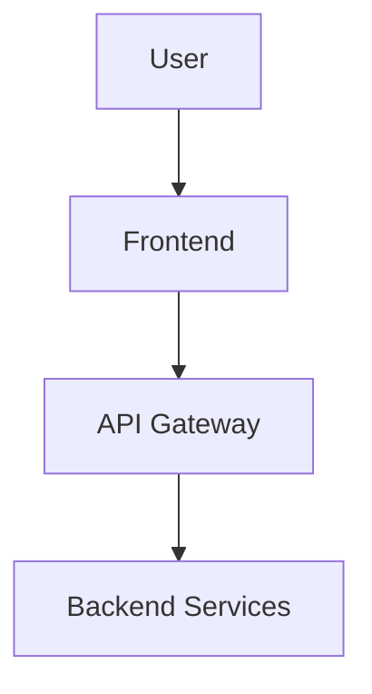
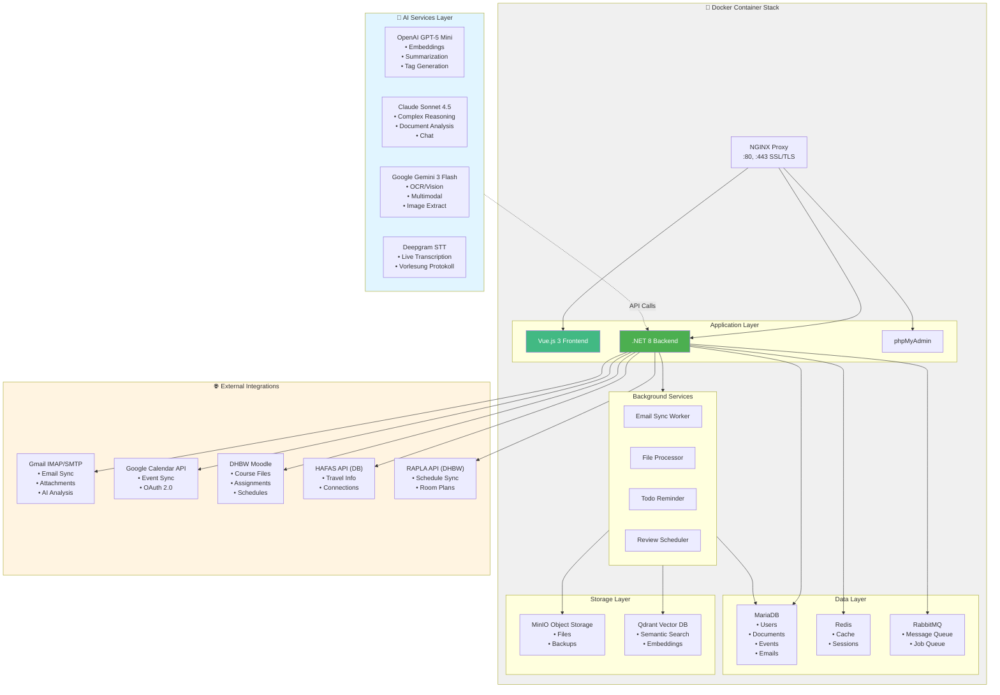

# 📚 Dokumentation

Willkommen zur vollständigen Dokumentation des DHBW Study Automation Systems.

## 📋 Übersicht

Diese Dokumentation ist in verschiedene Bereiche unterteilt:

### Für Einsteiger

- **[SETUP_GUIDE.md](../SETUP_GUIDE.md)** - Schritt-für-Schritt Setup-Anleitung
- **[PROJECT_STRUCTURE.md](../PROJECT_STRUCTURE.md)** - Projekt-Struktur Übersicht
- **[CONTRIBUTING.md](../CONTRIBUTING.md)** - Wie du beitragen kannst

### Architektur & Design

- **[architecture.md](architecture.md)** - System-Architektur Details
- **[database.md](database.md)** - Datenbank Schema & Design
- **[api.md](api.md)** - REST API Dokumentation

### Features

- **[live-lecture-guide.md](live-lecture-guide.md)** - Live-Lecture-Mode Setup & Nutzung
- **[tutor-mode-guide.md](tutor-mode-guide.md)** - Tutor-Mode Setup & Nutzung
- **[mail-integration.md](mail-integration.md)** - E-Mail Integration
- **[moodle-integration.md](moodle-integration.md)** - Moodle Integration
- **[calendar-sync.md](calendar-sync.md)** - Kalender-Synchronisation

### Deployment & Operations

- **[deployment.md](deployment.md)** - Deployment Strategien
- **[monitoring.md](monitoring.md)** - Monitoring & Logging
- **[backup.md](backup.md)** - Backup & Recovery
- **[security.md](security.md)** - Security Best Practices

### Entwicklung

- **[development-guide.md](development-guide.md)** - Entwicklungs-Workflow
- **[testing.md](testing.md)** - Testing Strategien
- **[troubleshooting.md](troubleshooting.md)** - Häufige Probleme & Lösungen

### AI Services

- **[ai-integration.md](ai-integration.md)** - Multi-AI Gateway
- **[openai-guide.md](openai-guide.md)** - OpenAI GPT & Whisper
- **[claude-guide.md](claude-guide.md)** - Anthropic Claude
- **[gemini-guide.md](gemini-guide.md)** - Google Gemini

## 🚀 Quick Links

### API Dokumentation

- **Swagger UI (Dev)**: http://localhost:5000/swagger
- **Postman Collection**: [Download](postman/collection.json)

### Externe Ressourcen

- **.NET 8 Docs**: https://learn.microsoft.com/en-us/dotnet/
- **Vue.js Docs**: https://vuejs.org/
- **MariaDB Docs**: https://mariadb.com/kb/
- **Docker Docs**: https://docs.docker.com/

## 📝 Dokumentations-Standards

### Markdown Style

- Use ATX-style headers (`#` statt `===`)
- Code blocks mit Language Identifier
- Relative Links für interne Docs
- Keine trailing whitespace

### Beispiel

````markdown
# Feature Name

## Übersicht

Kurze Beschreibung des Features.

## Setup

```bash
npm install
npm run dev
```

## Usage

```typescript
import { useFeature } from '@/composables'

const { data } = useFeature()
```

## Siehe auch

- [Related Doc](related.md)
- [External Link](https://example.com)
````

## 🔄 Dokumentation aktualisieren

Wenn du Code änderst, aktualisiere bitte auch die relevante Dokumentation:

1. **API-Änderungen** → `api.md` aktualisieren
2. **Neue Features** → Feature-Guide erstellen
3. **Breaking Changes** → Migration Guide
4. **Bug Fixes** → `troubleshooting.md` erweitern

## 📊 Diagramme

Diagramme werden mit [Mermaid](https://mermaid.js.org/) erstellt:



## 🙋 Fragen?

Bei Fragen zur Dokumentation:

- 💬 Discord: [Link zum Discord]
- 📧 E-Mail: docs@example.com
- 🐛 Issue: [Documentation Issue erstellen](https://github.com/yourusername/dhbw-automation/issues/new?labels=documentation)

## 🏗️ System-Architektur


---

**Letzte Aktualisierung:** 2026-01-07
